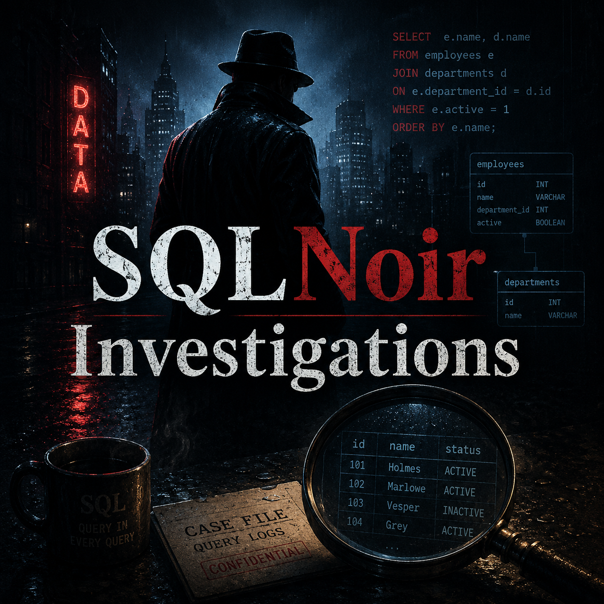

# SQLNoir Investigations

<p align="center">
  
</p>

<p align="center">
  
  
  
  
</p>

A polished SQL investigation portfolio built around **SQLNoir** mystery cases.

This repository documents a collection of SQL-based detective investigations where each case is solved by querying relational tables, extracting clues, joining evidence, narrowing suspects, and reaching a final data-backed conclusion.

Instead of presenting the work as simple practice queries, this project is structured as a professional **SQL casebook** with clean documentation, case-level writeups, schema visuals, and commented SQL solutions.

---

## Project Overview

**SQLNoir Investigations** is a portfolio-style repository that demonstrates how SQL can be used for structured problem-solving, investigative analysis, and evidence-based reasoning.

Each case includes:

* a case-specific banner
* a short mystery brief
* a visual database schema
* clean SQL queries
* step-by-step investigation logic
* final culprit verdict
* skills demonstrated

The goal of this project is to show not only that the cases were solved, but also how the solution was reached through clear SQL reasoning.

---

## Why This Project Matters

Real data work is rarely just about writing a query.

It often requires understanding the business problem, finding the right tables, identifying useful fields, filtering noise, connecting records, and explaining the conclusion clearly.

This project demonstrates that process through crime-style SQL investigations.

The cases showcase:

* how to translate a vague problem into SQL queries
* how to investigate relational data step by step
* how to combine clues across multiple tables
* how to use SQL output to support logical decisions
* how to communicate technical reasoning clearly

---

## Case Index

| Level        | Case | Title                          | Culprit        | Key SQL Concepts                                   |
| ------------ | ---: | ------------------------------ | -------------- | -------------------------------------------------- |
| Easy         |  001 | The Vanishing Briefcase        | Vincent Malone | `WHERE`, `AND`, `IN`                               |
| Easy         |  002 | The Stolen Sound               | Rico Delgado   | `WHERE`, clue matching, `IN`                       |
| Intermediate |  003 | The Miami Marina Murder        | Thomas Brown   | `JOIN`, `LIKE`, filtering, deduction               |
| Intermediate |  006 | The Vanishing Diamond          | Mike Manning   | `JOIN`, witness clues, multi-table filtering       |
| Advanced     |  004 | The Midnight Masquerade Murder | Marco Santos   | multi-step joins, phone records, logical deduction |
| Advanced     |  005 | The Silicon Sabotage           | Hristo Bogoev  | access logs, email trails, facility records        |

---

## Repository Structure

```text
sqlnoir-investigations/
├── .gitignore
├── README.md
├── assets
│   ├── repo-banner.png
│   ├── repo-thumbnail.png
│   └── visual-guidelines.md
├── cases
│   ├── easy
│   │   ├── 001-vanishing-briefcase
│   │   │   ├── README.md
│   │   │   ├── banner.png
│   │   │   ├── schema.png
│   │   │   └── solution.sql
│   │   └── 002-stolen-sound
│   │       ├── README.md
│   │       ├── banner.png
│   │       ├── schema.png
│   │       └── solution.sql
│   ├── intermediate
│   │   ├── 003-miami-marina-murder
│   │   │   ├── README.md
│   │   │   ├── banner.png
│   │   │   ├── schema.png
│   │   │   └── solution.sql
│   │   └── 006-vanishing-diamond
│   │       ├── README.md
│   │       ├── banner.png
│   │       ├── schema.png
│   │       └── solution.sql
│   └── advanced
│       ├── 004-midnight-masquerade-murder
│       │   ├── README.md
│       │   ├── banner.png
│       │   ├── schema.png
│       │   └── solution.sql
│       └── 005-silicon-sabotage
│           ├── README.md
│           ├── banner.png
│           ├── schema.png
│           └── solution.sql
└── templates
    ├── case-readme-template.md
    └── solution-template.sql
```

---

## Featured Case Format

Each case folder is designed to be self-contained.

A typical case includes:

```text
README.md       # Case walkthrough and final explanation
solution.sql    # Clean SQL solution with comments
schema.png      # Visual schema diagram
banner.png      # Case-specific visual banner
```

This makes every investigation easy to read independently.

---

## Example Investigation Flow

A typical SQLNoir investigation follows this process:

```text
Crime Brief
   ↓
Identify known facts
   ↓
Query the crime or incident report
   ↓
Extract useful clues
   ↓
Search related tables
   ↓
Join supporting evidence
   ↓
Narrow down suspects
   ↓
Check interviews, confessions, logs, or records
   ↓
Reach final verdict
```

This process mirrors how analytical work is often performed in real data environments: start with a question, locate the relevant data, filter carefully, connect evidence, and explain the outcome.

---

## SQL Skills Demonstrated

This repository demonstrates practical SQL skills including:

* `SELECT` statements
* `WHERE` filtering
* multiple condition filtering with `AND` / `OR`
* wildcard searches with `LIKE`
* filtering with `IN`
* `INNER JOIN` across related tables
* aggregation with `GROUP BY`
* filtering aggregates with `HAVING`
* date and text-based filtering
* multi-step query logic
* evidence-based analytical reasoning

---

## Analytical Skills Demonstrated

Beyond SQL syntax, the project also highlights broader data analysis skills:

* breaking down ambiguous problems
* identifying relevant tables and columns
* extracting clues from text fields
* validating assumptions with query results
* narrowing candidate records logically
* documenting findings clearly
* communicating final conclusions with evidence

---

## Case Difficulty Breakdown

### Easy Cases

The easy cases focus on direct filtering and simple clue matching.

| Case                               | Focus                                         |
| ---------------------------------- | --------------------------------------------- |
| Case #001: The Vanishing Briefcase | Matching witness description to suspects      |
| Case #002: The Stolen Sound        | Combining witness clues to identify the thief |

### Intermediate Cases

The intermediate cases introduce joins, broader suspect pools, and multi-table reasoning.

| Case                               | Focus                                                                      |
| ---------------------------------- | -------------------------------------------------------------------------- |
| Case #003: The Miami Marina Murder | Joining hotel records, surveillance logs, and confessions                  |
| Case #006: The Vanishing Diamond   | Combining guest records, witness clues, attire records, and marina rentals |

### Advanced Cases

The advanced cases require deeper investigation across several connected datasets.

| Case                                      | Focus                                                                          |
| ----------------------------------------- | ------------------------------------------------------------------------------ |
| Case #004: The Midnight Masquerade Murder | Hotel bookings, surveillance, phone records, occupations, and final interviews |
| Case #005: The Silicon Sabotage           | Keycard logs, computer access, emails, facility records, and employee records  |

---

## Visual Design

<p align="center">
  
</p>

The repository follows a consistent noir-inspired visual identity:

* dark cinematic backgrounds
* detective casefile styling
* SQL and database-inspired visual elements
* case-specific banners
* clean schema visuals
* structured README layouts

The visual direction is documented in:

```text
assets/visual-guidelines.md
```

---

## How to Read This Repository

Start with the main case index above, then open any case folder.

For each case, read the files in this order:

1. `README.md` — explains the case and investigation logic
2. `schema.png` — shows the database structure
3. `solution.sql` — contains the final SQL queries

Each case README includes the final culprit in a dedicated verdict box.

---

## Sample Case Preview

### Case #001: The Vanishing Briefcase

The first case begins at the **Blue Note Lounge**, where a valuable briefcase containing sensitive documents disappears.

The investigation starts by querying the crime scene report, which reveals that the suspect was seen wearing a trench coat and had a scar on his left cheek. The suspects table is then filtered using those two clues, and the interview transcripts confirm the culprit.

Final verdict:

<table>
  <tr>
    <th>Case Solved</th>
  </tr>
  <tr>
    <td align="center">
      <strong>Vincent Malone</strong>
    </td>
  </tr>
</table>

---

## Tools Used

* SQL
* SQLite-style syntax
* SQLNoir
* Markdown
* GitHub
* Visual schema diagrams
* AI-assisted visual asset generation

---

## Project Goals

The goals of this repository are to:

* practice SQL through realistic mystery-style cases
* document SQL solutions clearly
* show analytical reasoning, not just final answers
* build a polished data portfolio project
* demonstrate how SQL can support structured investigation and decision-making

---

## Notes on Data and Source

The cases are based on SQLNoir challenges.

This repository contains my own:

* SQL solutions
* investigation notes
* explanations
* visual documentation
* case walkthroughs

It does not include the original SQLNoir database files.

---

## Portfolio Value

This project is designed to demonstrate the kind of thinking needed in analytics, data engineering, and business intelligence work.

It shows the ability to:

* query structured data
* connect information across tables
* work through incomplete clues
* document technical reasoning
* present analysis in a clear and polished way

---

## Author

**Adham Elkhouly**

* Data analytics and automation-focused professional with experience in SQL, Power BI, Power Platform, reporting, and process automation.
* Power Platform Functional Consultant Associate

This repository was created as a portfolio project to demonstrate SQL investigation skills, structured problem-solving, and clear technical documentation.

---

## License

This project is licensed under the MIT License.

See the `LICENSE` file for details.
