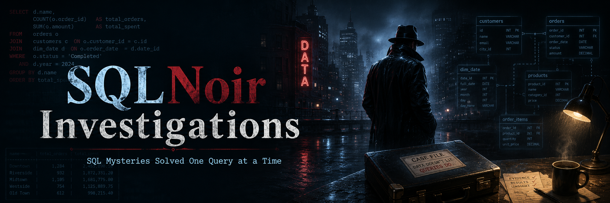
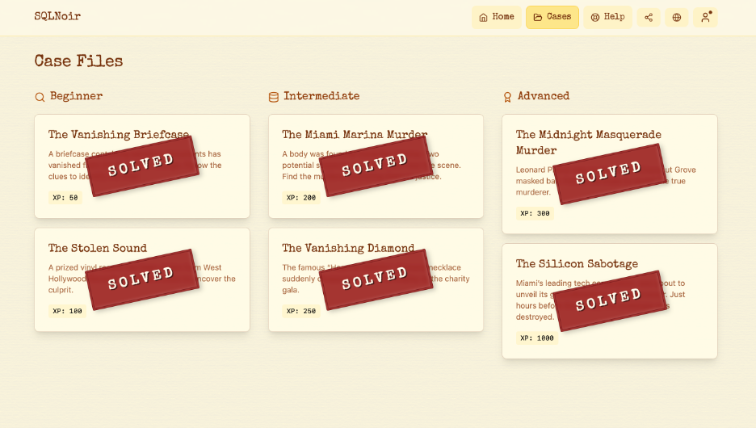

# SQLNoir Investigations

<p align="center">
  
</p>

<p align="center">
  
  
  
  
  
</p>

## Overview

**SQLNoir Investigations** is a polished SQL portfolio project built around mystery-style database investigations.

Each case is solved by querying relational tables, extracting clues, joining evidence, narrowing suspects, and reaching a final data-backed conclusion. The goal of this repository is not only to show that I can write SQL queries, but also to demonstrate how I approach ambiguous problems, structure an investigation, and communicate technical reasoning clearly.

This project presents SQL as a practical analytical tool for investigation, evidence discovery, and decision-making.

---

## Completion Proof

I completed all available SQLNoir cases across **Easy**, **Intermediate**, and **Advanced** levels.

<p align="center">
  
</p>

---

## Project Purpose

Real data work is rarely just about writing a single query.

In analytics, business intelligence, and data engineering, the real challenge is often understanding the question, finding the right tables, identifying useful fields, filtering noisy data, connecting evidence across sources, and explaining the final answer clearly.

This project demonstrates that process through SQL-based detective cases.

Each investigation shows how I:

* translate vague case details into SQL queries
* inspect relational database schemas
* identify useful tables and columns
* filter records using clues
* join related evidence across tables
* validate assumptions with query results
* document the full reasoning process
* communicate a final conclusion clearly

---

## Case Index

| Level        | Case | Title                                                                           | Culprit        | Main SQL Concepts                                    |
| :----------- | ---: | :------------------------------------------------------------------------------ | :------------- | :--------------------------------------------------- |
| Easy         |  001 | [The Vanishing Briefcase](cases/easy/001-vanishing-briefcase)                   | Vincent Malone | `WHERE`, `AND`, `IN`, clue filtering                 |
| Easy         |  002 | [The Stolen Sound](cases/easy/002-stolen-sound)                                 | Rico Delgado   | `WHERE`, clue matching, suspect filtering            |
| Intermediate |  003 | [The Miami Marina Murder](cases/intermediate/003-miami-marina-murder)           | Thomas Brown   | `JOIN`, `LIKE`, filtering, deduction                 |
| Intermediate |  006 | [The Vanishing Diamond](cases/intermediate/006-vanishing-diamond)               | Mike Manning   | `JOIN`, multi-table filtering, witness clues         |
| Advanced     |  004 | [The Midnight Masquerade Murder](cases/advanced/004-midnight-masquerade-murder) | Marco Santos   | multi-step joins, phone records, logical deduction   |
| Advanced     |  005 | [The Silicon Sabotage](cases/advanced/005-silicon-sabotage)                     | Hristo Bogoev  | access logs, emails, facility records, employee data |

---

## Repository Structure

```text
sqlnoir-investigations/
├── .gitignore
├── LICENSE
├── README.md
├── assets
│   ├── repo-banner.png
│   ├── repo-thumbnail.png
│   ├── sqlnoir-all-cases-solved.png
├── cases
│   ├── advanced
│   │   ├── 004-midnight-masquerade-murder
│   │   │   ├── README.md
│   │   │   ├── banner.png
│   │   │   ├── schema.png
│   │   │   └── solution.sql
│   │   └── 005-silicon-sabotage
│   │       ├── README.md
│   │       ├── banner.png
│   │       ├── schema.png
│   │       └── solution.sql
│   ├── easy
│   │   ├── 001-vanishing-briefcase
│   │   │   ├── README.md
│   │   │   ├── banner.png
│   │   │   ├── schema.png
│   │   │   └── solution.sql
│   │   └── 002-stolen-sound
│   │       ├── README.md
│   │       ├── banner.png
│   │       ├── schema.png
│   │       └── solution.sql
│   └── intermediate
│       ├── 003-miami-marina-murder
│       │   ├── README.md
│       │   ├── banner.png
│       │   ├── schema.png
│       │   └── solution.sql
│       └── 006-vanishing-diamond
│           ├── README.md
│           ├── banner.png
│           ├── schema.png
│           └── solution.sql
└── templates
    ├── case-readme-template.md
    ├── schema-template.mmd.png
    └── solution-template.sql
```

---

## What Each Case Contains

Each case folder is designed to be self-contained and easy to review.

```text
README.md       # Full case walkthrough, reasoning, and final verdict
solution.sql    # Clean SQL solution with comments
schema.png      # Visual database schema
banner.png      # Case-specific visual banner
```

This structure allows each investigation to stand alone as a mini case study.

---

## Investigation Methodology

Each SQLNoir case follows a structured investigation process:

```text
Read the case brief
        ↓
Identify known facts and clues
        ↓
Inspect the database schema
        ↓
Query the relevant tables
        ↓
Filter records using evidence
        ↓
Join related tables
        ↓
Narrow the suspect pool
        ↓
Validate against witness statements, logs, or records
        ↓
Reach a final verdict
        ↓
Document the reasoning clearly
```

This mirrors the workflow used in real-world analytical work: start with a question, understand the available data, build evidence step by step, and present a supported conclusion.

---

## Skills Demonstrated

### SQL Skills

This repository demonstrates practical SQL skills including:

* `SELECT` statements
* `WHERE` filtering
* multiple condition filtering with `AND` and `OR`
* wildcard searches with `LIKE`
* filtering using `IN`
* `INNER JOIN` across related tables
* multi-table joins
* aggregation with `GROUP BY`
* filtering aggregates with `HAVING`
* date-based filtering
* text-based filtering
* ordered query logic
* multi-step SQL investigations

### Analytical Skills

Beyond SQL syntax, this project highlights analytical thinking skills including:

* breaking down ambiguous problems
* identifying relevant tables and columns
* extracting clues from unstructured text fields
* validating assumptions through query results
* narrowing candidate records logically
* connecting evidence across datasets
* documenting reasoning clearly
* presenting conclusions in a professional format

### Documentation Skills

This project also demonstrates technical documentation through:

* structured case writeups
* consistent folder organization
* schema visuals
* readable SQL comments
* case summaries
* final verdict sections
* reusable templates

---

## Difficulty Breakdown

### Easy Cases

The easy cases focus on direct filtering, simple clue matching, and basic suspect elimination.

| Case                                                                    | Focus                                                               |
| :---------------------------------------------------------------------- | :------------------------------------------------------------------ |
| [Case 001: The Vanishing Briefcase](cases/easy/001-vanishing-briefcase) | Filtering suspects based on physical clues and witness descriptions |
| [Case 002: The Stolen Sound](cases/easy/002-stolen-sound)               | Combining simple clues to identify the thief                        |

### Intermediate Cases

The intermediate cases introduce more connected evidence, joins, and broader suspect pools.

| Case                                                                            | Focus                                                                              |
| :------------------------------------------------------------------------------ | :--------------------------------------------------------------------------------- |
| [Case 003: The Miami Marina Murder](cases/intermediate/003-miami-marina-murder) | Joining hotel records, surveillance logs, and confession evidence                  |
| [Case 006: The Vanishing Diamond](cases/intermediate/006-vanishing-diamond)     | Combining guest records, witness clues, attire records, and marina rental evidence |

### Advanced Cases

The advanced cases require deeper multi-table reasoning and longer investigation chains.

| Case                                                                                      | Focus                                                                                          |
| :---------------------------------------------------------------------------------------- | :--------------------------------------------------------------------------------------------- |
| [Case 004: The Midnight Masquerade Murder](cases/advanced/004-midnight-masquerade-murder) | Investigating hotel bookings, surveillance, phone records, occupations, and interviews         |
| [Case 005: The Silicon Sabotage](cases/advanced/005-silicon-sabotage)                     | Investigating access logs, computer records, email trails, facility records, and employee data |

---

## Featured Case Preview

### Case 001: The Vanishing Briefcase

The first case begins at the **Blue Note Lounge**, where a valuable briefcase containing sensitive documents disappears.

The investigation starts by reviewing the case details and identifying key witness clues. The suspect was described as wearing a trench coat and having a scar on his left cheek. The SQL investigation filters the suspect table using those clues, then uses supporting records to confirm the final culprit.

**Final Verdict:** Vincent Malone

This case demonstrates how even simple SQL filtering can become powerful when paired with structured reasoning.

---

## How to Review This Repository

For the best review experience:

1. Start with the **Case Index** in this README.
2. Open any case folder.
3. Read the case `README.md`.
4. View the `schema.png` to understand the database structure.
5. Review `solution.sql` to see the actual SQL queries.
6. Compare the query logic with the final verdict.

Recommended first case:

```text
cases/easy/001-vanishing-briefcase
```

Recommended advanced case:

```text
cases/advanced/005-silicon-sabotage
```

---

## Tools and Technologies

* SQL
* SQLite-style querying
* Markdown
* GitHub
* Relational database analysis
* Schema diagrams
* SQLNoir
* AI-assisted visual asset generation

---

## Portfolio Value

This repository is designed as a data portfolio project for roles involving:

* data analysis
* business intelligence
* analytics engineering
* data engineering
* reporting automation
* SQL-based investigation
* structured problem-solving

It demonstrates the ability to move beyond basic query writing and use SQL to investigate data, connect evidence, and communicate results clearly.

---

## Notes on SQLNoir

The cases in this repository are based on **SQLNoir**, an open-source SQL detective game.

This repository contains my own:

* SQL solutions
* investigation notes
* case walkthroughs
* schema visuals
* documentation structure
* portfolio presentation

This repository does not include the original SQLNoir database files.

---

## Project Goals

The goals of this project are to:

* practice SQL through realistic mystery-style investigations
* solve all available SQLNoir cases
* document SQL solutions clearly
* show analytical reasoning instead of only final answers
* build a polished technical portfolio project
* demonstrate how SQL supports structured investigation and decision-making

---

## 🧑‍💻 Author

**Adham Elkhouly**

- Reporting & Analytics Specialist @ Nestlé
- Microsoft Power Platform Functional Consultant Associate

This repository was created as a portfolio project to demonstrate SQL investigation skills, structured problem-solving, and clear technical documentation.

---

## License

This project is licensed under the MIT License.

See the [`LICENSE`](LICENSE) file for details.
