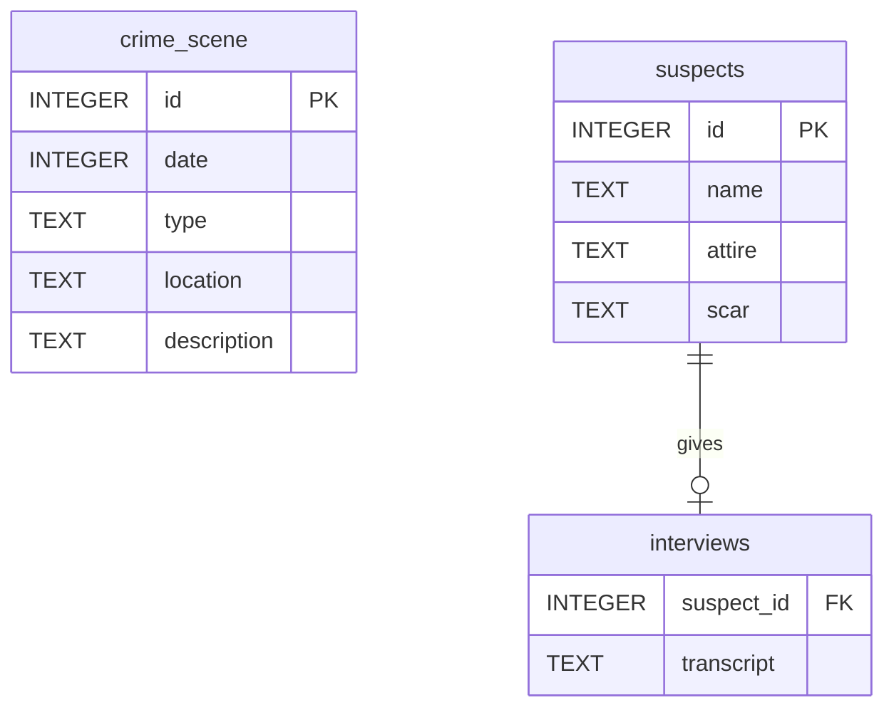

# Visual Guidelines

This document defines the visual style used across the **SQLNoir Investigations** repository.
The goal is to keep every banner, schema diagram, and case asset consistent, polished, and portfolio-ready.

---

## 1. Visual Identity

**Theme:** SQL detective work, noir mystery, data investigation
**Mood:** cinematic, dark, analytical, professional
**Inspiration:** 1980s detective noir, database systems, SQL terminals, case files, crime boards, neon city lights

The visuals should make the repository feel like a professional SQL investigation casebook rather than a simple collection of practice queries.

---

## 2. Core Design Principles

### Keep it consistent

All case banners and diagrams should follow the same general layout, naming style, and visual mood.

### Keep it readable

The project should look stylish, but never at the expense of clarity. Text, table names, and schema fields should be easy to read.

### Keep it professional

The visuals can be cinematic and creative, but they should still feel appropriate for a GitHub portfolio project.

### Keep it data-focused

Every visual should support the main idea of the repository: solving mysteries through SQL and structured data analysis.

---

## 3. Color Palette

Use a dark noir-inspired palette with cool blue tones, subtle red accents, and occasional warm gold highlights.

| Purpose              | Suggested Color | Usage                               |
| -------------------- | --------------- | ----------------------------------- |
| Main background      | `#05070A`       | Dark backgrounds, banners           |
| Secondary background | `#0B1320`       | Panels, cards, diagram backgrounds  |
| Steel blue           | `#1E3A5F`       | Borders, schema accents             |
| Neon blue            | `#4DA3FF`       | Highlights, SQL/data elements       |
| Deep red             | `#B91C1C`       | Danger, mystery, emphasis           |
| Off-white            | `#F3F4F6`       | Main text                           |
| Muted gray           | `#9CA3AF`       | Secondary text                      |
| Gold accent          | `#D4AF37`       | Case numbers, small premium details |

Avoid using too many bright colors at once. The repo should feel sleek, not chaotic.

---

## 4. Typography Style

Use bold, readable typography for titles and simple clean fonts for documentation.

### Recommended title style

* Large
* Bold
* High contrast
* Slightly cinematic or vintage
* White, off-white, or gold

### Recommended body/documentation style

* Clean and simple
* Easy to read on GitHub
* Avoid overly decorative fonts in diagrams

### Suggested fonts for designs

These are not required, but they fit the visual identity:

| Use            | Suggested Font Style                           |
| -------------- | ---------------------------------------------- |
| Main title     | Condensed bold serif or cinematic display font |
| Subtitle       | Monospace or clean sans-serif                  |
| SQL text       | Monospace                                      |
| Diagram labels | Clean sans-serif                               |

For GitHub markdown, default fonts are fine.

---

## 5. Repository Banner Guidelines

The main repository banner should be placed in:

```text
assets/repo-banner.png
```

Recommended size:

```text
2560 x 720 px
```

Minimum acceptable size:

```text
1280 x 420 px
```

### Banner should include

* Repository title: `SQLNoir Investigations`
* Short subtitle, such as: `SQL Mysteries Solved One Query at a Time`
* Noir detective atmosphere
* SQL/database elements
* Dark city or investigation setting
* Clean readable text

### Banner should avoid

* Too much small unreadable text
* Random database tables that distract from the title
* Overcrowded layouts
* Bright cartoonish colors
* Inconsistent typography

---

## 6. Repository Thumbnail Guidelines

The repository thumbnail should be placed in:

```text
assets/repo-thumbnail.png
```

Recommended size:

```text
1200 x 1200 px
```

The thumbnail should work well as:

* a GitHub social preview image
* a LinkedIn project image
* a portfolio card image

### Thumbnail should include

* `SQLNoir Investigations`
* A detective/noir visual
* SQL or database elements
* Strong contrast
* Centered composition

The thumbnail should still be understandable even when displayed small.

---

## 7. Case Banner Guidelines

Each case folder should include a case-specific banner:

```text
cases/<difficulty>/<case-folder>/banner.png
```

Recommended size:

```text
1600 x 500 px
```

Each banner should include:

```text
Case #XXX: Case Title
SQLNoir Investigation
```

Example:

```text
Case #001: The Vanishing Briefcase
SQLNoir Investigation
```

### Case banner visual style

Use a cinematic scene related to the case theme.

Examples:

| Case                           | Possible Visual Direction                       |
| ------------------------------ | ----------------------------------------------- |
| The Vanishing Briefcase        | smoky lounge, briefcase, trench coat silhouette |
| The Stolen Sound               | record store, vinyl, neon Los Angeles           |
| The Miami Marina Murder        | docks, marina, night water, hotel clues         |
| The Midnight Masquerade Murder | mansion, masked ball, garden, phone records     |
| The Silicon Sabotage           | tech campus, microprocessor, access logs        |
| The Vanishing Diamond          | gala, necklace display, marina clue             |

Keep all banners visually related through the same noir/data-investigation style.

---

## 8. Schema Diagram Guidelines

Each case folder should include:

```text
schema.mmd
schema.png
```

### `schema.mmd`

This is the editable Mermaid source file.

### `schema.png`

This is the exported visual version shown in the case README.

Recommended schema image size:

```text
1600 x 900 px
```

### Schema diagrams should include

* All tables used in the case
* Primary keys marked as `PK`
* Foreign keys marked as `FK`
* Clear relationships between tables
* Clean spacing
* Readable table and column names

### Schema diagrams should avoid

* Tiny unreadable text
* Overlapping relationship lines
* Too many decorative elements
* Inconsistent table styling
* AI-generated field names that do not match the actual schema

Accuracy matters more than decoration.

---

## 9. Mermaid ER Diagram Style

Use Mermaid ER diagrams for editable schema files.

Example:



### Mermaid naming rules

* Use exact table names from the case
* Use exact column names from the case
* Keep data types simple and readable
* Use lowercase table names
* Use relationship labels only when they add clarity

---

## 10. README Visual Layout

Each case README should start with the banner:

```md
<p align="center">
  
</p>
```

Then include the schema image:

```md
<p align="center">
  
</p>
```

### Recommended case README order

```text
Banner
Case title
Difficulty
Case summary
Objective
Database schema
Tables used
Investigation process
SQL steps
Final verdict
Skills demonstrated
Conclusion
```

This creates a consistent reading experience across all cases.

---

## 11. Final Verdict Box Style

Since this repository does not rely on final-result screenshots, every case README should include a clean verdict box.

Use this format:

```md
## Final Verdict

<table>
  <tr>
    <th>Case Solved</th>
  </tr>
  <tr>
    <td align="center">
      <strong>CULPRIT NAME HERE</strong>
    </td>
  </tr>
</table>
```

Example:

```md
## Final Verdict

<table>
  <tr>
    <th>Case Solved</th>
  </tr>
  <tr>
    <td align="center">
      <strong>Vincent Malone</strong>
    </td>
  </tr>
</table>
```

This keeps the project clean and avoids needing screenshots for every solved case.

---

## 12. File Naming Rules

Use lowercase folder and file names.

### Good

```text
repo-banner.png
repo-thumbnail.png
visual-guidelines.md
banner.png
schema.png
schema.mmd
solution.sql
README.md
```

### Avoid

```text
Final Banner NEW.png
schema final final.png
Query 1.sql
my notes updated.docx
case one thing.PNG
```

File names should be predictable and professional.

---

## 13. Case Folder Asset Rules

Each case folder should follow this structure:

```text
case-folder/
├── README.md
├── solution.sql
├── schema.mmd
├── schema.png
└── banner.png
```

Do not add unnecessary files unless they improve the portfolio value.

Avoid adding:

* raw screenshots with messy browser UI
* temporary files
* duplicate images
* unedited notes
* unfinished drafts

---

## 14. Image Quality Standards

Before adding an image to the repo, check:

* Is the title spelled correctly?
* Is the case number correct?
* Is the image clear at GitHub README size?
* Are table names readable?
* Does the image match the repository style?
* Is it professional enough for a recruiter or hiring manager to see?

If the answer is no, regenerate or redesign the image.

---

## 15. AI Image Generation Rules

AI-generated visuals are allowed, but they must be reviewed carefully.

### Always check for:

* spelling errors
* distorted text
* fake schema fields
* wrong case numbers
* unreadable SQL
* mismatched table names
* cluttered layouts

For banners, AI-generated text can sometimes be imperfect. If the text is distorted, create the image without text and add the title manually using Canva, Figma, PowerPoint, or another editor.

For schema diagrams, Mermaid-generated diagrams are preferred over AI-generated diagrams because they are more accurate.

---

## 16. Recommended Workflow for Visuals

### For banners

1. Generate or design the background.
2. Add clean title text manually.
3. Export as PNG.
4. Save as `banner.png`.

### For schemas

1. Write `schema.mmd`.
2. Render it using Mermaid Live Editor.
3. Export as PNG.
4. Save as `schema.png`.

### For README usage

Use relative paths only.

Example:

```md

```

---

## 17. Portfolio Quality Checklist

Before publishing the repo, confirm:

* [ ] Main README has a banner
* [ ] Main README has a case index table
* [ ] Every case has a `README.md`
* [ ] Every case has a `solution.sql`
* [ ] Every case has a `schema.mmd`
* [ ] Every case has a `schema.png`
* [ ] Every case has a `banner.png`
* [ ] Every case has a final verdict box
* [ ] SQL files are clean and commented
* [ ] No typos in case titles
* [ ] No messy raw notes
* [ ] No unnecessary screenshots
* [ ] All paths work on GitHub
* [ ] All visuals follow the same style

---

## 18. Overall Standard

The repository should feel like a polished data portfolio project.

The final impression should be:

> This person can solve SQL problems, explain their reasoning clearly, document technical work professionally, and present projects in a visually compelling way.

That is the standard for this repo.
