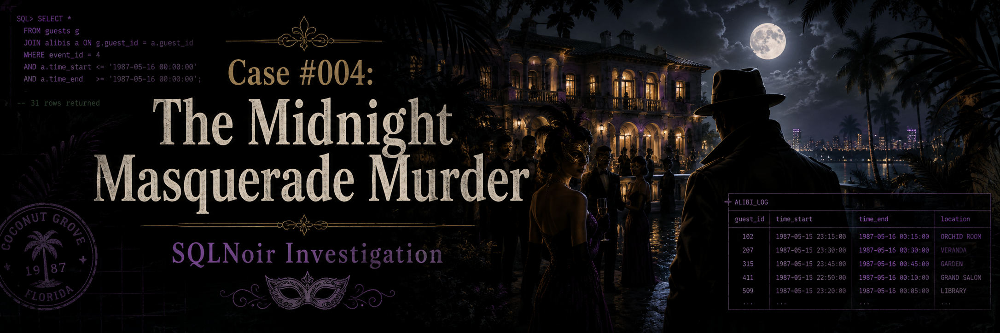
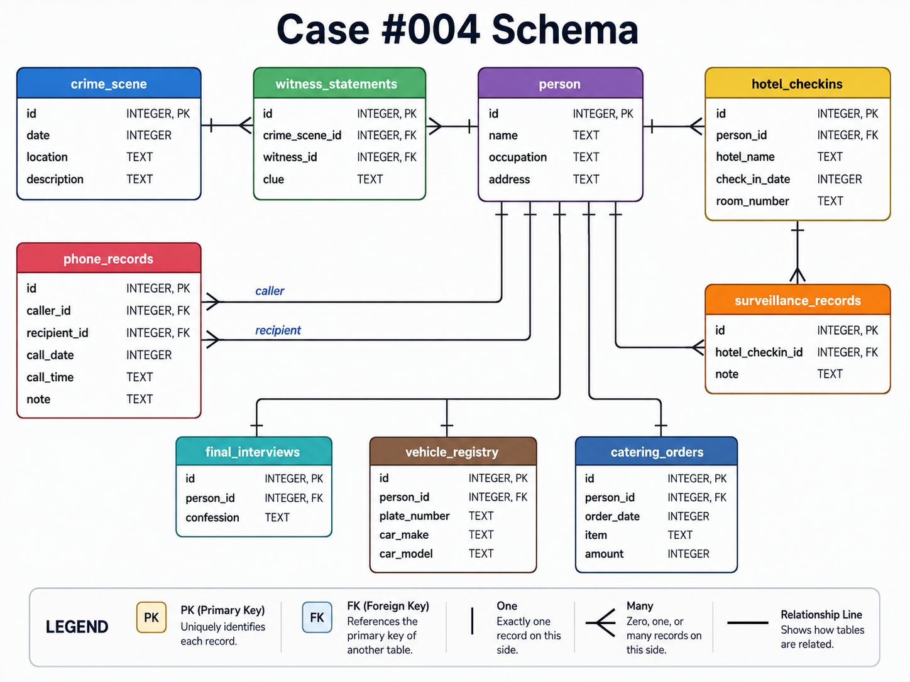

<p align="center">
  
</p>

# Case #004: The Midnight Masquerade Murder

## Difficulty

**Advanced**

## Case Summary

On **October 31, 1987**, during a masked ball at a Coconut Grove mansion, **Leonard Pierce** was found dead in the garden.

The case began with a crime scene report mentioning a hotel booking and suspicious phone activity. The investigation moved through hotel check-ins, surveillance records, phone records, and final interviews before revealing the true murderer.

## Objective

Use SQL to identify who murdered Leonard Pierce.

## Database Schema

<p align="center">
  
</p>

## Tables Used

| Table | Description |
|---|---|
| `crime_scene` | Contains the original crime scene report |
| `person` | Contains personal details, occupations, and addresses |
| `witness_statements` | Contains witness clues linked to the crime scene |
| `hotel_checkins` | Contains hotel booking records |
| `surveillance_records` | Contains hotel surveillance notes |
| `phone_records` | Contains phone call records between people |
| `final_interviews` | Contains final interview/confession records |
| `vehicle_registry` | Contains vehicle ownership records |
| `catering_orders` | Contains catering order records |

## Investigation Process

### Step 1: Retrieve the crime scene report

```sql
SELECT *
FROM crime_scene
WHERE date = 19871031
  AND location LIKE '%Coconut Grove%';
```

### Finding

The crime scene report confirmed that:

- The murder happened during a masked ball.
- A body was found in the garden.
- Witnesses mentioned a hotel booking.
- Witnesses also mentioned suspicious phone activity.

## Initial Case Details

| Detail | Value |
|---|---|
| Date | October 31, 1987 |
| Location | Miami Mansion, Coconut Grove |
| Event | Masked ball |
| Victim | Leonard Pierce |
| Crime Scene ID | 75 |

---

### Step 2: Retrieve witness statements

```sql
SELECT *
FROM witness_statements
WHERE crime_scene_id = 75;
```

### Result

| id | crime_scene_id | witness_id | clue |
|---:|---:|---:|---|
| 83 | 75 | 37 | I overheard a booking at The Grand Regency. |
| 89 | 75 | 42 | I noticed someone at the front desk discussing Room 707 for a reservation made yesterday. |

The witnesses gave three important booking clues.

## Hotel Booking Clues

| Clue | Value |
|---|---|
| Hotel | The Grand Regency |
| Room | 707 |
| Reservation Date | October 30, 1987 |

---

### Step 3: Find hotel check-ins matching the witness clues

```sql
SELECT *
FROM hotel_checkins
WHERE hotel_name = 'The Grand Regency'
  AND room_number = 707
  AND check_in_date = 19871030;
```

### Result

This returned multiple people connected to the same hotel, room, and date.

| person_id |
|---:|
| 78 |
| 123 |
| 34 |
| 11 |
| 198 |
| 178 |
| 156 |

At this stage, the suspect list was still broad.

---

### Step 4: Check repeat check-ins

```sql
SELECT 
    person_id,
    COUNT(*) AS number_of_checkins
FROM hotel_checkins
WHERE hotel_name = 'The Grand Regency'
  AND room_number = 707
  AND check_in_date = 19871030
GROUP BY person_id
HAVING COUNT(*) > 1
ORDER BY COUNT(*) DESC;
```

### Result

| person_id | number_of_checkins |
|---:|---:|
| 198 | 3 |
| 123 | 2 |

Repeat check-ins made these records suspicious, but this alone did not identify the murderer.

---

### Step 5: Review people linked to the hotel clue

```sql
SELECT *
FROM person
WHERE id IN (78, 123, 34, 11, 198, 178, 156);
```

### Result

| id | name | occupation | address |
|---:|---|---|---|
| 11 | Antonio Rossi | Auto Importer | 999 Dark Alley |
| 34 | Susan Scott | Psychologist | 861 Forest Drive |
| 78 | Frances Morgan | Financial Analyst | 909 Maplewood Street |
| 123 | Christopher Baker | Insurance Agent | 990 Oakwood Court |
| 156 | Kathy Fisher | Pharmacist | 667 Sycamorewood Drive |
| 178 | Lois Henderson | Painter | 112 Juniperwood Way |
| 198 | Gladys Henderson | Pharmacist | 334 Sycamorewood Drive |

---

### Step 6: Join hotel check-ins with surveillance records

```sql
SELECT 
    hc.id,
    hc.person_id,
    sr.note
FROM hotel_checkins AS hc
INNER JOIN surveillance_records AS sr
    ON hc.id = sr.hotel_checkin_id
WHERE hc.hotel_name = 'The Grand Regency'
  AND hc.room_number = 707
  AND hc.check_in_date = 19871030;
```

### Key Result

| hotel_checkin_id | person_id | note |
|---:|---:|---|
| 119 | 11 | Subject was overheard yelling on a phone: "Did you kill him?" |

Antonio Rossi became important because the surveillance note pointed to suspicious phone activity.

---

### Step 7: Investigate phone records connected to Antonio Rossi

```sql
SELECT 
    caller_id,
    recipient_id,
    call_date,
    call_time,
    note
FROM phone_records
WHERE caller_id = 11
   OR recipient_id = 11;
```

### Result

| caller_id | recipient_id | call_date | call_time | note |
|---:|---:|---:|---|---|
| 11 | 58 | 19871030 | 23:30 | Why did you kill him, bro? You should have left the carpenter do it himself! |

The phone record revealed two important things:

- Person **58** was involved as a middleman.
- The true killer was connected to the occupation **Carpenter**.

---

### Step 8: Find possible carpenters

```sql
SELECT *
FROM person
WHERE occupation = 'Carpenter';
```

### Result

| id | name | occupation | address |
|---:|---|---|---|
| 51 | Frank Price | Carpenter | 939 Hemlockwood Avenue |
| 90 | Julie Sanders | Carpenter | 345 Juniperwood Way |
| 97 | Marco Santos | Carpenter | 112 Forestwood Way |
| 134 | Amy Evans | Carpenter | 223 Redwood Road |
| 176 | Judith Fisher | Carpenter | 889 Redwood Road |

The investigation now focused on the middleman, suspicious hotel-related people, and the carpenter suspects.

---

### Step 9: Check final interviews

```sql
SELECT *
FROM final_interviews
WHERE person_id IN (58, 11, 198, 51, 90, 97, 134, 176);
```

### Result

| person_id | confession |
|---:|---|
| 11 | Im a peaceful person. I wouldnt kill anyone ever. |
| 51 | Youre making a mistake. I didnt kill that person. |
| 58 | I didn’t kill Leo per se. I was just a middleman. |
| 90 | I was visiting my parents. I couldnt possibly kill someone. |
| 97 | I ordered the hit. It was me. You caught me. |
| 134 | Check my internet service logs. Im not the murderer youre looking for. |
| 176 | The bank cameras caught me making a deposit. I wouldnt take a life. |
| 198 | Check my gym check-in records. I couldnt have killed anyone. |

Marco Santos confessed.

---

### Step 10: Retrieve the culprit’s identity

```sql
SELECT *
FROM person
WHERE id = 97;
```

### Result

| id | name | occupation | address |
|---:|---|---|---|
| 97 | Marco Santos | Carpenter | 112 Forestwood Way |

---

## Final Verdict

<table>
  <tr>
    <th>Case Solved</th>
  </tr>
  <tr>
    <td align="center">
      <strong>Marco Santos</strong>
    </td>
  </tr>
</table>

## Evidence Summary

| Evidence | Result |
|---|---|
| Witnesses mentioned The Grand Regency | Hotel check-ins were investigated |
| Witnesses mentioned Room 707 | Several suspects were connected to the room |
| Surveillance revealed suspicious phone activity | Antonio Rossi was linked to a call |
| Phone call mentioned a carpenter | Marco Santos was a carpenter |
| Final interview | Marco Santos confessed |

## Why Marco Santos?

The hotel clue led to a suspicious phone call. That call revealed that a middleman was involved and that the intended killer was a carpenter. After checking carpenter suspects and related persons in the final interviews, **Marco Santos** confessed that he ordered the hit.

## SQL Skills Demonstrated

- Filtering with `WHERE`
- Pattern matching with `LIKE`
- Joining multiple tables with `INNER JOIN`
- Aggregating with `GROUP BY`
- Filtering grouped results with `HAVING`
- Using `IN` to investigate suspect groups
- Following indirect evidence across multiple tables
- Evidence-based deduction in a multi-step investigation

## Conclusion

This case was solved by starting from the crime scene report, following witness clues to a hotel booking, using surveillance records to identify suspicious phone activity, tracing the phone record to a middleman, narrowing the clue to a carpenter, and confirming the culprit through final interview evidence.

**Culprit:** Marco Santos