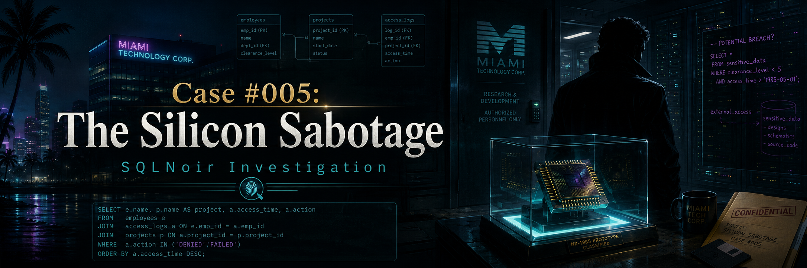
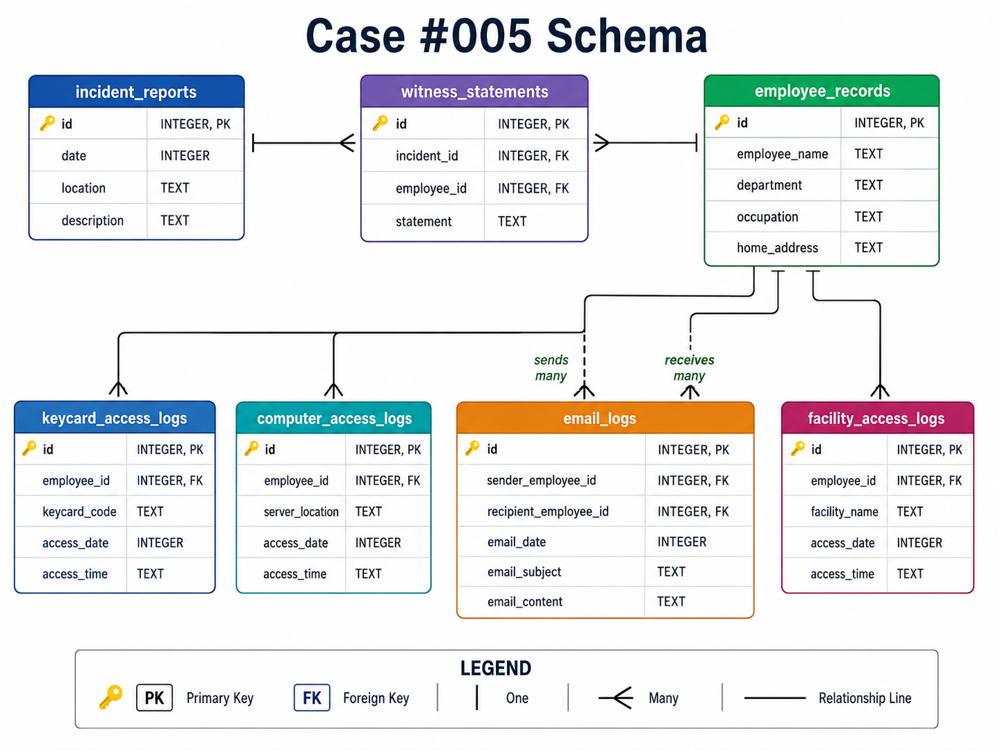

<p align="center">
  
</p>

# Case #005: The Silicon Sabotage

## Difficulty

**Advanced**

## Case Summary

QuantumTech, Miami’s leading technology corporation, was preparing to unveil its groundbreaking microprocessor, **QuantaX**.

Just hours before the reveal, the prototype was destroyed and the research data was erased from the company’s servers. Detectives suspected corporate espionage.

The investigation followed keycard access logs, computer access logs, emails, facility access records, and employee records to uncover the person behind the sabotage.

## Objective

Use SQL to identify who sabotaged the QuantaX microprocessor.

## Database Schema

<p align="center">
  
</p>

## Tables Used

| Table | Description |
|---|---|
| `incident_reports` | Contains the original sabotage incident report |
| `witness_statements` | Contains employee witness statements linked to the incident |
| `keycard_access_logs` | Contains employee keycard access records |
| `computer_access_logs` | Contains server access records |
| `email_logs` | Contains internal email communication between employees |
| `facility_access_logs` | Contains facility entry records |
| `employee_records` | Contains employee details, departments, occupations, and addresses |

## Investigation Process

### Step 1: Retrieve the incident report

```sql
SELECT *
FROM incident_reports
WHERE location LIKE '%QuantumTech%';
```

### Finding

The report confirmed that:

- The incident happened at **QuantumTech HQ**.
- The prototype was destroyed.
- Research data was erased from the servers.
- The incident date was **April 21, 1989**.
- The incident ID was **74**.

## Initial Case Details

| Detail | Value |
|---|---|
| Company | QuantumTech |
| Location | QuantumTech HQ |
| Product | QuantaX microprocessor |
| Incident Date | April 21, 1989 |
| Incident ID | 74 |
| Suspected Motive | Corporate espionage |

---

### Step 2: Retrieve witness statements

```sql
SELECT *
FROM witness_statements
WHERE incident_id = 74;
```

### Result

| id | incident_id | employee_id | statement |
|---:|---:|---:|---|
| 40 | 74 | 145 | I heard someone mention a server in Helsinki. |
| 59 | 74 | 134 | I saw someone holding a keycard marked QX- succeeded by a two-digit odd number. |

The witnesses provided two major clues.

## Key Clues

| Clue | Value |
|---|---|
| Server Location | Helsinki |
| Keycard Pattern | `QX-` followed by a two-digit odd number |

---

### Step 3: Find keycard records matching the QX clue

```sql
SELECT *
FROM keycard_access_logs
WHERE keycard_code LIKE 'QX-0__'
  AND substr(keycard_code, -1) IN ('1', '3', '5', '7', '9')
  AND access_date = 19890421;
```

This returned many possible employees, so the suspect list was still too broad.

---

### Step 4: Join keycard access with Helsinki server access

```sql
SELECT 
    ca.employee_id,
    ca.server_location,
    ca.access_date,
    ca.access_time
FROM computer_access_logs AS ca
INNER JOIN keycard_access_logs AS ka
    ON ca.employee_id = ka.employee_id
WHERE ka.keycard_code LIKE 'QX-0__'
  AND substr(ka.keycard_code, -1) IN ('1', '3', '5', '7', '9')
  AND ka.access_date = 19890421
  AND ca.server_location LIKE '%Helsinki%';
```

### Result

| employee_id | server_location | access_date | access_time |
|---:|---|---:|---|
| 99 | Helsinki | 19890421 | 09:00 |

This narrowed the investigation to **employee 99**.

---

### Step 5: Review emails connected to employee 99

```sql
SELECT *
FROM email_logs
WHERE sender_employee_id = 99
   OR recipient_employee_id = 99;
```

### Result

| sender_employee_id | recipient_employee_id | email_date | email_subject | email_content |
|---:|---:|---:|---|---|
| 263 | 99 | 19890421 | Alarm System Concern | I noticed something strange with the alarm system. There might be a potential malfunction near the chip. Thought you should check it out to be safe. |

Employee 99 was sent an email that encouraged them to check the alarm system near the chip.

---

### Step 6: Identify employee 99 and employee 263

```sql
SELECT *
FROM employee_records
WHERE id IN (99, 263);
```

### Result

| id | employee_name | department | occupation | home_address |
|---:|---|---|---|---|
| 99 | Elizabeth Gordon | Engineering | Solutions Architect | 147 Coastal Pine Rd, Doral, FL |
| 263 | Norman Owens | Quantum Computing | Quantum Systems Engineer | 234 Quantum Waters Lane, Key Biscayne, FL |

Employee 99 was **Elizabeth Gordon**.  
Employee 263 was **Norman Owens**.

At this point, Elizabeth looked suspicious, but the email suggested that someone may have pushed her toward the chip area.

---

### Step 7: Review witness statements for Elizabeth and Norman

```sql
SELECT *
FROM witness_statements
WHERE employee_id IN (99, 263);
```

### Result

| id | incident_id | employee_id | statement |
|---:|---:|---:|---|
| 17 | NULL | 99 | That day, I received an email from a colleague saying something was wrong with the alarm system. I went to check it out, but didn’t find anything unusual. |

Elizabeth’s statement confirmed that she went to check the alarm system because of the email. Norman did not have a witness statement here, which made him more suspicious.

---

### Step 8: Check Norman Owens’ keycard access

```sql
SELECT *
FROM keycard_access_logs
WHERE employee_id = 263;
```

### Result

No records were found.

Norman appeared to be involved, but he did not directly use his own keycard in the access logs.

---

### Step 9: Review Norman Owens’ email history

```sql
SELECT *
FROM email_logs
WHERE sender_employee_id = 263
   OR recipient_employee_id = 263;
```

### Result

| sender_employee_id | recipient_employee_id | email_date | email_subject | email_content |
|---:|---:|---:|---|---|
| 263 | 99 | 19890421 | Alarm System Concern | I noticed something strange with the alarm system. There might be a potential malfunction near the chip. Thought you should check it out to be safe. |
| NULL | 263 | 19890421 | Realign Asset Trajectory | L’s schedule puts her close enough, but we need her inside F18 before 9. Trigger a minor alert or routine checkup to send her in by 8:30. Make sure she logs the visit. That part matters. |
| NULL | 263 | 19890421 | Execute Phase Window | Unlock 18 quietly by 9. He’ll use his own credentials to access it shortly after L leaves. No questions. Just ensure the timing lines up. The trail will lead exactly where it needs to. |

These emails revealed that Elizabeth was likely being framed.

## Key Email Findings

| Clue | Meaning |
|---|---|
| `L’s schedule` | Likely refers to Elizabeth Gordon |
| `inside F18 before 9` | Elizabeth needed to be moved into Facility 18 |
| `He’ll use his own credentials` | Another person would access Facility 18 after Elizabeth |
| `The trail will lead exactly where it needs to` | The plan was designed to frame someone else |

---

### Step 10: Check Facility 18 access records

```sql
SELECT *
FROM facility_access_logs
WHERE facility_name = 'Facility 18'
  AND access_date = 19890421;
```

### Result

| id | employee_id | facility_name | access_date | access_time |
|---:|---:|---|---:|---|
| 74 | 99 | Facility 18 | 19890421 | 08:55 |
| 81 | 297 | Facility 18 | 19890421 | 09:01 |
| 59 | 290 | Facility 18 | 19890421 | 12:56 |

Elizabeth entered Facility 18 at **08:55**.  
Employee 297 entered shortly after at **09:01**, matching the email plan.

---

### Step 11: Check employee 297

```sql
SELECT *
FROM employee_records
WHERE id = 297;
```

### Result

| id | employee_name | department | occupation | home_address |
|---:|---|---|---|---|
| 297 | Hristo Bogoev | Engineering | Principal Engineer | 901 Quantum Ocean Way, Key Biscayne, FL |

Employee 297 was **Hristo Bogoev**.

He accessed Facility 18 shortly after Elizabeth, matching the suspicious email instructions.

---

## Final Verdict

<table>
  <tr>
    <th>Case Solved</th>
  </tr>
  <tr>
    <td align="center">
      <strong>Hristo Bogoev</strong>
    </td>
  </tr>
</table>

## Evidence Summary

| Evidence | Result |
|---|---|
| Witness mentioned Helsinki server access | Elizabeth Gordon appeared in the initial joined result |
| Elizabeth received an alarm email | She was pushed toward the chip area |
| Norman received anonymous instructions | The plan involved moving Elizabeth into Facility 18 |
| Email mentioned someone using their own credentials shortly after Elizabeth left | Hristo Bogoev entered Facility 18 at 09:01 |
| Facility 18 access logs | Hristo accessed the facility shortly after Elizabeth |

## Why Hristo Bogoev?

Elizabeth Gordon initially appeared suspicious because she matched the keycard and Helsinki server clues. However, the email trail showed that she was likely manipulated into entering Facility 18.

Norman Owens received anonymous instructions to move Elizabeth into place and unlock Facility 18. Those instructions said that another person would use his own credentials shortly after she left. The access logs then showed **Hristo Bogoev** entering Facility 18 at **09:01**, directly after Elizabeth’s **08:55** entry.

That timing made Hristo the true saboteur.

## SQL Skills Demonstrated

- Filtering records with `WHERE`
- Pattern matching with `LIKE`
- String filtering with `substr`
- Joining logs with `INNER JOIN`
- Investigating communication trails through email logs
- Connecting indirect evidence across multiple systems
- Using timestamp-based reasoning
- Evidence-based deduction in a multi-table investigation

## Conclusion

This case was solved by combining witness clues, keycard logs, server access records, email communication, and facility access logs. The investigation initially pointed toward Elizabeth Gordon, but the deeper email and access-log evidence revealed that she was being framed.

The true saboteur was **Hristo Bogoev**.

**Culprit:** Hristo Bogoev