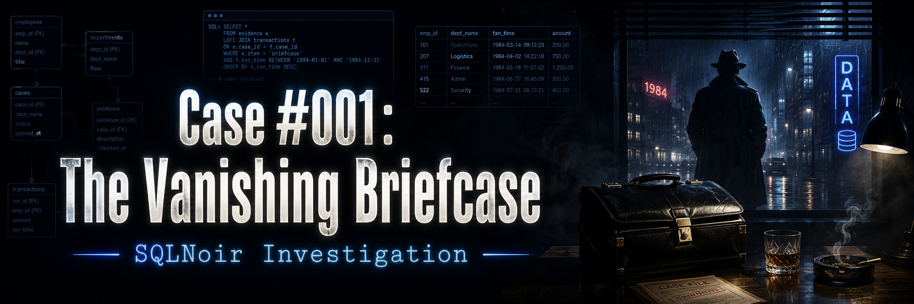
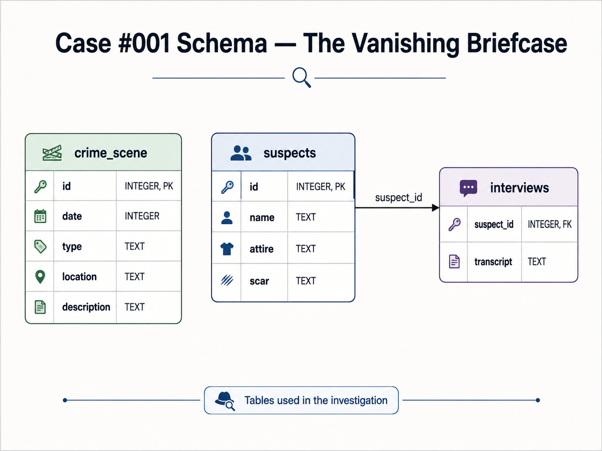

<p align="center">
  
</p>

# Case #001: The Vanishing Briefcase

## Difficulty
**Easy**

## Case Summary

A valuable briefcase containing sensitive documents disappeared from the **Blue Note Lounge**.  
A witness reported seeing a man in a trench coat fleeing the scene.

The investigation begins by reviewing the crime scene report, identifying the physical description of the suspect, narrowing down matching suspects, and confirming the culprit through interview transcripts.

## Objective

Identify the person responsible for stealing the briefcase using SQL.

## Database Schema

<p align="center">
  
</p>

## Tables Used

| Table | Purpose |
|---|---|
| `crime_scene` | Stores crime reports, including date, type, location, and description |
| `suspects` | Stores suspect profiles, including attire and scars |
| `interviews` | Stores interview transcripts linked to suspects |

## Investigation Process

### Step 1: Retrieve the crime scene report

The first step was to find the crime scene record for the **Blue Note Lounge**.

```sql
SELECT *
FROM crime_scene
WHERE location = 'Blue Note Lounge';
```

### Key Finding

The report revealed that the briefcase was stolen and that a witness saw:

> A man in a trench coat with a scar on his left cheek fleeing the scene.

This gave us two important clues:

| Clue Type | Value |
|---|---|
| Attire | Trench coat |
| Scar | Left cheek |

---

### Step 2: Find suspects matching the witness description

Using the witness description, I filtered the suspects table for anyone wearing a trench coat and having a scar on the left cheek.

```sql
SELECT *
FROM suspects
WHERE attire = 'trench coat'
  AND scar = 'left cheek';
```

### Result

| id | name | attire | scar |
|---:|---|---|---|
| 3 | Frankie Lombardi | trench coat | left cheek |
| 183 | Vincent Malone | trench coat | left cheek |

At this stage, there were two possible suspects:

- Frankie Lombardi
- Vincent Malone

---

### Step 3: Check interview transcripts

To confirm which suspect was responsible, I reviewed the interview transcripts for both matching suspects.

```sql
SELECT *
FROM interviews
WHERE suspect_id IN (3, 183);
```

### Result

| suspect_id | transcript |
|---:|---|
| 3 | NULL |
| 183 | I wasn’t going to steal it, but I did. |

Vincent Malone’s interview transcript contained a confession.

---

## Final Verdict

<table>
  <tr>
    <th>Case Solved</th>
  </tr>
  <tr>
    <td align="center">
      <strong>Vincent Malone</strong>
    </td>
  </tr>
</table>

## Why Vincent Malone?

Vincent Malone matched the witness description and confessed during the interview.

| Evidence | Match |
|---|---|
| Seen fleeing the Blue Note Lounge | Supported by crime scene report |
| Wore a trench coat | Yes |
| Had a scar on left cheek | Yes |
| Interview confirmed guilt | Yes |

## SQL Skills Demonstrated

- Filtering records with `WHERE`
- Combining multiple conditions with `AND`
- Using `IN` to check multiple suspect IDs
- Reading query results to support logical deduction
- Building an evidence-based investigation process

## Conclusion

This case was solved by starting with the crime scene report, extracting the witness clues, narrowing the suspect list using SQL filters, and confirming the culprit through interview evidence.

**Culprit:** Vincent Malone