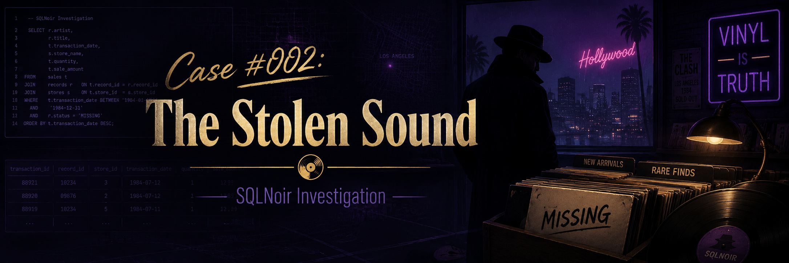
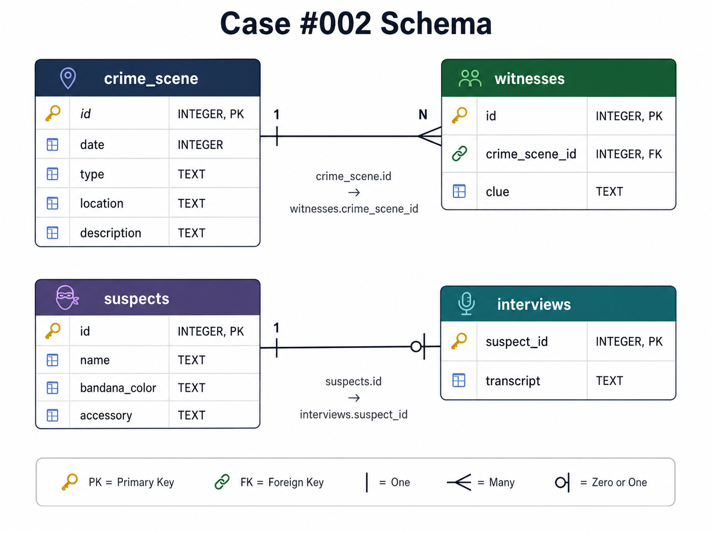

<p align="center">
  
</p>

# Case #002: The Stolen Sound

## Difficulty

**Easy**

## Case Summary

A prized vinyl record worth over **$10,000** was stolen from **West Hollywood Records** during a busy evening.

The incident happened on **July 15, 1983**. The investigation required finding the crime scene report, reviewing witness clues, matching those clues against the suspects table, and confirming the culprit through interview transcripts.

## Objective

Use SQL to identify who stole the vinyl record.

## Database Schema

<p align="center">
  
</p>

## Tables Used

| Table | Description |
|---|---|
| `crime_scene` | Contains crime scene details such as date, type, location, and description |
| `witnesses` | Contains witness clues linked to a crime scene |
| `suspects` | Contains suspect profiles, including bandana color and accessories |
| `interviews` | Contains interview transcripts linked to suspect IDs |

## Investigation Process

### Step 1: Retrieve the crime scene report

```sql
SELECT *
FROM crime_scene
WHERE location = 'West Hollywood Records'
  AND type = 'theft';
```

### Finding

The crime scene report confirmed that:

- The theft happened at **West Hollywood Records**.
- A prized vinyl record was stolen.
- The theft occurred during a busy evening.
- The crime scene ID was **65**.

## Known Case Details

| Detail | Value |
|---|---|
| Date | July 15, 1983 |
| Location | West Hollywood Records |
| Crime Type | Theft |
| Stolen Item | Prized vinyl record |
| Crime Scene ID | 65 |

---

### Step 2: Retrieve witness clues

```sql
SELECT *
FROM witnesses
WHERE crime_scene_id = 65;
```

### Result

| id | crime_scene_id | clue |
|---:|---:|---|
| 28 | 65 | I saw a man wearing a red bandana rushing out of the store. |
| 75 | 65 | The main thing I remember is that he had a distinctive gold watch on his wrist. |

The witnesses provided two key clues.

## Key Clues

| Clue | Value |
|---|---|
| Bandana Color | Red |
| Accessory | Gold watch |

---

### Step 3: Find suspects matching the witness clues

```sql
SELECT *
FROM suspects
WHERE bandana_color = 'red'
  AND accessory = 'gold watch';
```

### Result

| id | name | bandana_color | accessory |
|---:|---|---|---|
| 35 | Tony Ramirez | red | gold watch |
| 44 | Mickey Rivera | red | gold watch |
| 97 | Rico Delgado | red | gold watch |

At this point, there were three possible suspects:

- Tony Ramirez
- Mickey Rivera
- Rico Delgado

---

### Step 4: Check interview transcripts

```sql
SELECT *
FROM interviews
WHERE suspect_id IN (35, 44, 97);
```

### Result

| suspect_id | transcript |
|---:|---|
| 35 | I wasn't anywhere near West Hollywood Records that night. |
| 44 | I was busy with my music career; I have nothing to do with this theft. |
| 97 | I couldn't help it. I snapped and took the record. |

Rico Delgado’s interview transcript confirmed that he stole the vinyl record.

---

## Final Verdict

<table>
  <tr>
    <th>Case Solved</th>
  </tr>
  <tr>
    <td align="center">
      <strong>Rico Delgado</strong>
    </td>
  </tr>
</table>

## Evidence Summary

| Evidence | Result |
|---|---|
| Suspect wore a red bandana | Rico Delgado matched |
| Suspect had a gold watch | Rico Delgado matched |
| Interview transcript confirmed guilt | Rico Delgado confessed |

## Why Rico Delgado?

Rico Delgado matched both witness clues and admitted in his interview that he took the record.

## SQL Skills Demonstrated

- Filtering records with `WHERE`
- Combining multiple conditions with `AND`
- Retrieving linked witness clues using a foreign key
- Using `IN` to check multiple suspect IDs
- Interpreting SQL query results
- Evidence-based deduction

## Conclusion

This case was solved by using the crime scene report to identify the correct witness records, extracting the suspect description from those witness clues, filtering suspects based on the matching details, and confirming the culprit through interview evidence.

**Culprit:** Rico Delgado