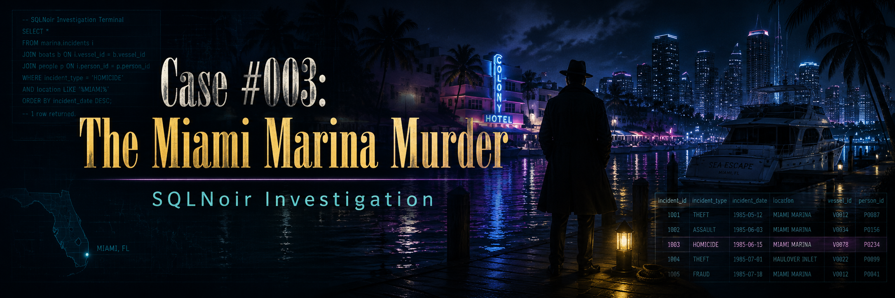
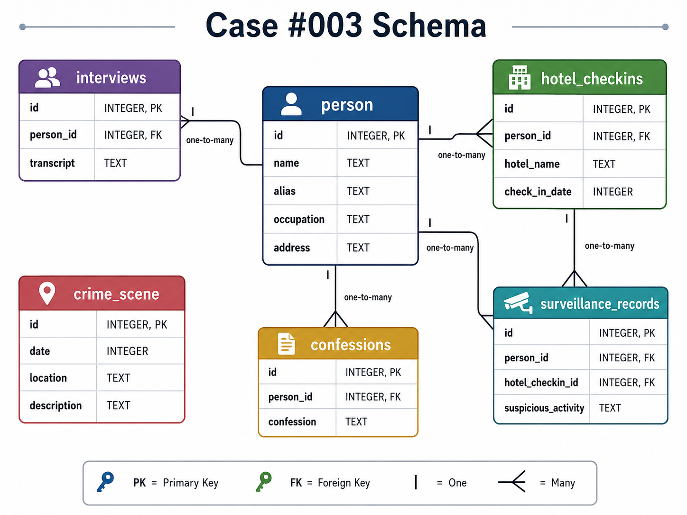

<p align="center">
  
</p>

# Case #003: The Miami Marina Murder

## Difficulty

**Intermediate**

## Case Summary

A body was found floating near the docks of **Coral Bay Marina** in the early hours of **August 14, 1986**.

The crime scene report mentioned two people seen nearby. Their clues led the investigation toward a hotel connected to the word **Sunset**, where suspicious surveillance activity helped narrow down the suspect list.

## Objective

Use SQL to identify the murderer.

## Database Schema

<p align="center">
  
</p>

## Tables Used

| Table | Description |
|---|---|
| `crime_scene` | Contains the original crime scene report |
| `person` | Contains personal details, aliases, occupations, and addresses |
| `interviews` | Contains interview transcripts linked to people |
| `hotel_checkins` | Contains hotel check-in records |
| `surveillance_records` | Contains suspicious activity linked to hotel check-ins |
| `confessions` | Contains final confession statements |

## Investigation Process

### Step 1: Retrieve the crime scene report

```sql
SELECT *
FROM crime_scene
WHERE location = 'Coral Bay Marina';
```

### Finding

The crime scene report revealed that:

- The body of an unidentified man was found near the docks.
- Two people were seen nearby.
- One person lived on a **300ish Ocean Drive** address.
- Another person had a first name ending in **"ul"** and a last name ending in **"ez"**.

## Initial Clues

| Clue | Value |
|---|---|
| Crime Date | August 14, 1986 |
| Location | Coral Bay Marina |
| Address Clue | 300ish Ocean Drive |
| Name Clue | First name ends with `ul`, last name ends with `ez` |

---

### Step 2: Identify the two people seen nearby

```sql
SELECT *
FROM person
WHERE address LIKE '3__ Ocean Drive'
   OR name LIKE '%ul %ez';
```

### Result

| id | name | alias | occupation | address |
|---:|---|---|---|---|
| 101 | Carlos Mendez | Los Ojos | Fisherman | 369 Ocean Drive |
| 102 | Raul Gutierrez | The Cobra | Nightclub Owner | 45 Sunset Ave |

The two people seen near the marina were:

- Carlos Mendez
- Raul Gutierrez

---

### Step 3: Review their interview transcripts

```sql
SELECT 
    i.id AS interview_id,
    p.name,
    p.alias,
    i.transcript
FROM person AS p
INNER JOIN interviews AS i
    ON p.id = i.person_id
WHERE p.address LIKE '3__ Ocean Drive'
   OR p.name LIKE '%ul %ez';
```

### Result

| interview_id | name | alias | transcript |
|---:|---|---|---|
| 101 | Carlos Mendez | Los Ojos | I saw someone check into a hotel on August 13. The guy looked nervous. |
| 103 | Raul Gutierrez | The Cobra | I heard someone checked into a hotel with "Sunset" in the name. |

The interviews pointed to a hotel check-in:

| Clue | Value |
|---|---|
| Hotel Name | Contains `Sunset` |
| Check-in Date | August 13, 1986 |
| Behavior | Person looked nervous |

---

### Step 4: Find Sunset hotel check-ins on August 13

```sql
SELECT *
FROM hotel_checkins
WHERE hotel_name LIKE '%Sunset%'
  AND check_in_date = 19860813;
```

This returned many possible check-ins, so the investigation needed another table to narrow the suspect list.

---

### Step 5: Join hotel check-ins with surveillance records

```sql
SELECT 
    sr.person_id,
    sr.suspicious_activity
FROM hotel_checkins AS hc
INNER JOIN surveillance_records AS sr
    ON hc.person_id = sr.person_id
WHERE hc.hotel_name LIKE '%Sunset%'
  AND hc.check_in_date = 19860813;
```

### Key Suspicious Results

| person_id | suspicious_activity |
|---:|---|
| 6 | Spotted entering late at night |
| 7 | Seen arguing with an unknown person |
| 8 | Left suddenly at 3 AM |

These three people had the most suspicious activity connected to the Sunset hotel clue.

---

### Step 6: Check confessions for suspicious people

```sql
SELECT 
    sr.person_id,
    p.name,
    sr.suspicious_activity,
    c.confession
FROM hotel_checkins AS hc
INNER JOIN surveillance_records AS sr
    ON hc.person_id = sr.person_id
INNER JOIN confessions AS c
    ON sr.person_id = c.person_id
INNER JOIN person AS p
    ON p.id = c.person_id
WHERE c.person_id IN (6, 7, 8);
```

### Result

| person_id | name | suspicious_activity | confession |
|---:|---|---|---|
| 6 | James Wilson | Spotted entering late at night | I don't know anything about this. |
| 7 | Robert Smith | Seen arguing with an unknown person | I was just walking my dog that night. |
| 8 | Thomas Brown | Left suddenly at 3 AM | Alright! I did it. I was paid to make sure he never left the marina alive. |

Thomas Brown confessed.

---

## Final Verdict

<table>
  <tr>
    <th>Case Solved</th>
  </tr>
  <tr>
    <td align="center">
      <strong>Thomas Brown</strong>
    </td>
  </tr>
</table>

## Evidence Summary

| Evidence | Result |
|---|---|
| Hotel clue pointed to a Sunset hotel | Thomas Brown was connected through hotel/surveillance records |
| Suspicious activity | He left suddenly at 3 AM |
| Confession | He admitted to the murder |

## Why Thomas Brown?

Thomas Brown was connected to the suspicious hotel trail and had the strongest surveillance behavior: he **left suddenly at 3 AM**. His confession then confirmed that he was the murderer.

## SQL Skills Demonstrated

- Filtering with `WHERE`
- Pattern matching with `LIKE`
- Joining multiple tables using `INNER JOIN`
- Using date filters
- Narrowing broad query results using additional evidence
- Evidence-based deduction across multiple linked tables

## Conclusion

This case was solved by starting from the marina crime scene, extracting witness clues, using pattern matching to identify nearby people, following the hotel trail, joining surveillance data, and confirming the murderer through confession evidence.

**Culprit:** Thomas Brown