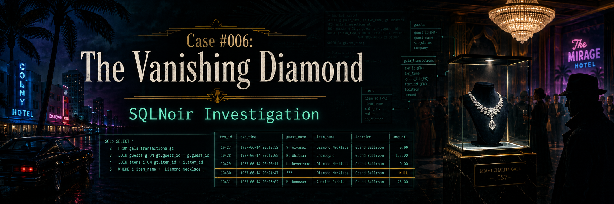
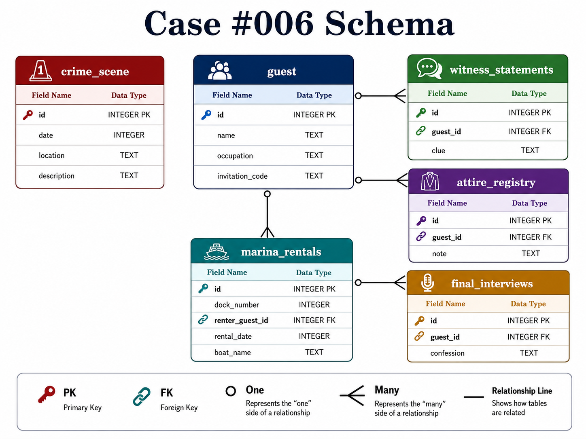

<p align="center">
  
</p>

# Case #006: The Vanishing Diamond

## Difficulty

**Intermediate**

## Case Summary

During a charity gala at Miami’s prestigious **Fontainebleau Hotel**, the famous **Heart of Atlantis** diamond necklace disappeared from its display.

The investigation began with the crime scene report, which revealed that only two guests gave useful clues. One was a famous actor, and the other was a consultant whose first name ended with **"an"**. Their clues led to a guest wearing a specific outfit, holding a specific invitation code, and being connected to a marina rental at **dock 3**.

## Objective

Use SQL to identify who stole the Heart of Atlantis diamond necklace.

## Database Schema

<p align="center">
  
</p>

## Tables Used

| Table | Description |
|---|---|
| `crime_scene` | Contains the original crime scene report |
| `guest` | Contains gala guest details, occupations, and invitation codes |
| `witness_statements` | Contains witness clues linked to guests |
| `attire_registry` | Contains outfit notes for gala guests |
| `marina_rentals` | Contains boat rental records linked to guests |
| `final_interviews` | Contains final interview/confession records |

## Investigation Process

### Step 1: Retrieve the crime scene report

```sql
SELECT *
FROM crime_scene
WHERE location = 'Fontainebleau Hotel';
```

### Finding

The crime scene report revealed that:

- The **Heart of Atlantis** necklace disappeared.
- Many guests were questioned.
- Only two guests gave useful clues.
- One useful witness was a famous actor.
- The other useful witness was a female consultant whose first name ended with **"an"**.

## Initial Case Details

| Detail | Value |
|---|---|
| Location | Fontainebleau Hotel |
| Stolen Item | Heart of Atlantis diamond necklace |
| Event | Charity gala |
| Useful Witness 1 | Famous actor |
| Useful Witness 2 | Female consultant, first name ends with `an` |

---

### Step 2: Identify the useful witnesses

```sql
SELECT *
FROM guest
WHERE occupation = 'Actor'
   OR (occupation = 'Consultant' AND name LIKE '%an %');
```

### Result

| id | name | occupation | invitation_code |
|---:|---|---|---|
| 43 | Ruby Baker | Actor | VIP-R |
| 116 | Vivian Nair | Consultant | VIP-R |
| 129 | Clint Eastwood | Actor | VIP-G |
| 164 | River Bowers | Actor | VIP-B |
| 189 | Sage Dillon | Actor | VIP-G |
| 192 | Phoenix Pitts | Actor | VIP-G |

The famous actor clue points to **Clint Eastwood**, and the consultant clue points to **Vivian Nair**.

---

### Step 3: Retrieve witness statements

```sql
SELECT 
    g.id,
    g.name,
    ws.clue
FROM guest AS g
INNER JOIN witness_statements AS ws
    ON g.id = ws.guest_id
WHERE g.id IN (116, 129);
```

### Result

| id | name | clue |
|---:|---|---|
| 116 | Vivian Nair | I saw someone holding an invitation ending with "-R". He was wearing a navy suit and a white tie. |
| 129 | Clint Eastwood | I overheard someone say, "Meet me at the marina, dock 3." |

The witnesses provided two major clues.

## Key Clues

| Source | Clue |
|---|---|
| Vivian Nair | Invitation code ending in `-R`, navy suit, white tie |
| Clint Eastwood | Marina meeting at dock 3 |

---

### Step 4: Find the guest matching the invitation and attire clues

```sql
SELECT 
    g.id AS guest_id,
    g.name,
    g.invitation_code,
    ar.note
FROM guest AS g
INNER JOIN attire_registry AS ar
    ON g.id = ar.guest_id
WHERE g.invitation_code LIKE '%-R'
  AND ar.note = 'navy suit, white tie';
```

### Result

| guest_id | name | invitation_code | note |
|---:|---|---|---|
| 105 | Mike Manning | VIP-R | navy suit, white tie |

The attire and invitation clues both point to **Mike Manning**.

---

### Step 5: Check marina rentals for dock 3

```sql
SELECT *
FROM marina_rentals
WHERE renter_guest_id = 105
  AND dock_number = 3;
```

### Result

| id | dock_number | renter_guest_id | rental_date | boat_name |
|---:|---:|---:|---:|---|
| 44 | 3 | 105 | 19870520 | Coastal Spirit |

Mike Manning was connected to **dock 3**, which matched Clint Eastwood’s clue.

---

### Step 6: Check final interview

```sql
SELECT *
FROM final_interviews
WHERE guest_id = 105;
```

### Result

| id | guest_id | confession |
|---:|---:|---|
| 105 | 105 | I was the one who took the crystal. I guess I need a lawyer now? |

Mike Manning confessed.

---

## Final Verdict

<table>
  <tr>
    <th>Case Solved</th>
  </tr>
  <tr>
    <td align="center">
      <strong>Mike Manning</strong>
    </td>
  </tr>
</table>

## Evidence Summary

| Evidence | Result |
|---|---|
| Invitation code ended with `-R` | Mike Manning matched |
| Attire was navy suit and white tie | Mike Manning matched |
| Connected to marina dock 3 | Mike Manning rented a boat at dock 3 |
| Final interview | Mike Manning confessed |

## Why Mike Manning?

Mike Manning matched the invitation and attire clues from Vivian Nair’s statement. He was also connected to **dock 3**, matching Clint Eastwood’s marina clue. His final interview confirmed that he was responsible.

## SQL Skills Demonstrated

- Filtering records with `WHERE`
- Pattern matching with `LIKE`
- Joining related tables using `INNER JOIN`
- Using witness clues to reduce a suspect list
- Validating a suspect with secondary evidence
- Evidence-based deduction across multiple tables

## Conclusion

This case was solved by starting from the crime scene report, identifying the useful witnesses, extracting their clues, matching those clues against the guest and attire records, verifying the marina connection, and confirming the culprit through the final interview.

**Culprit:** Mike Manning